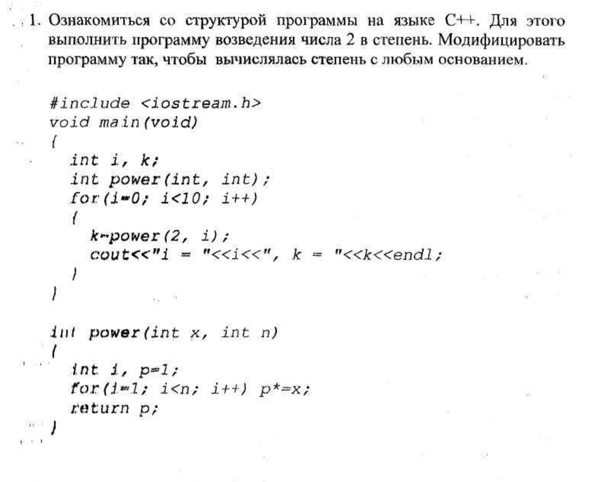
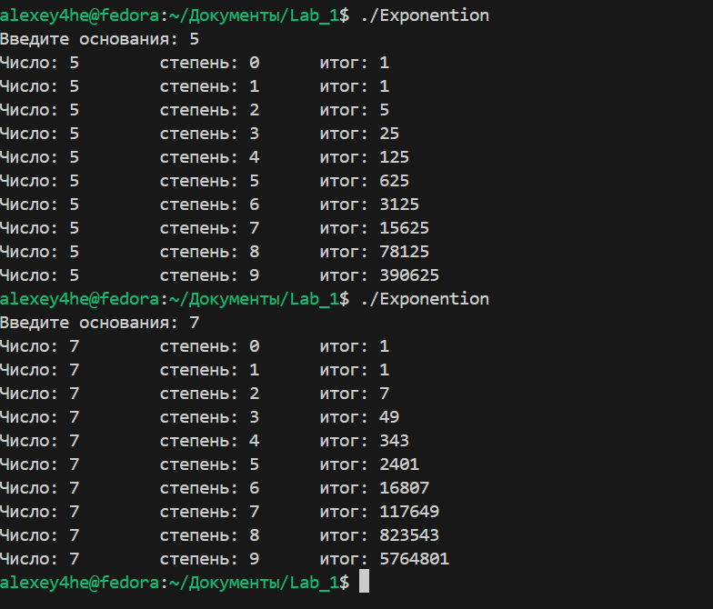
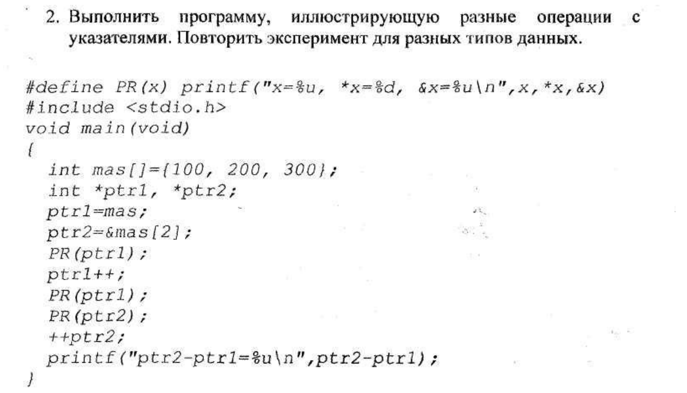
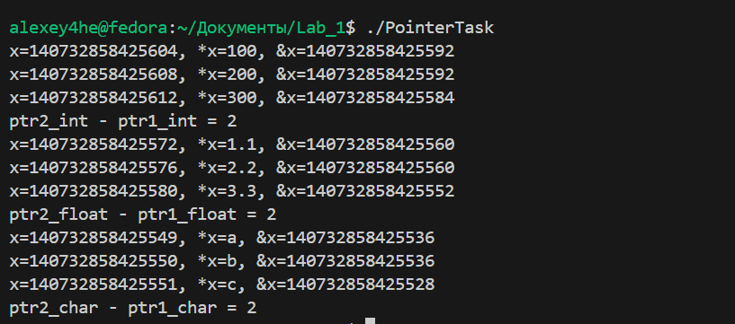
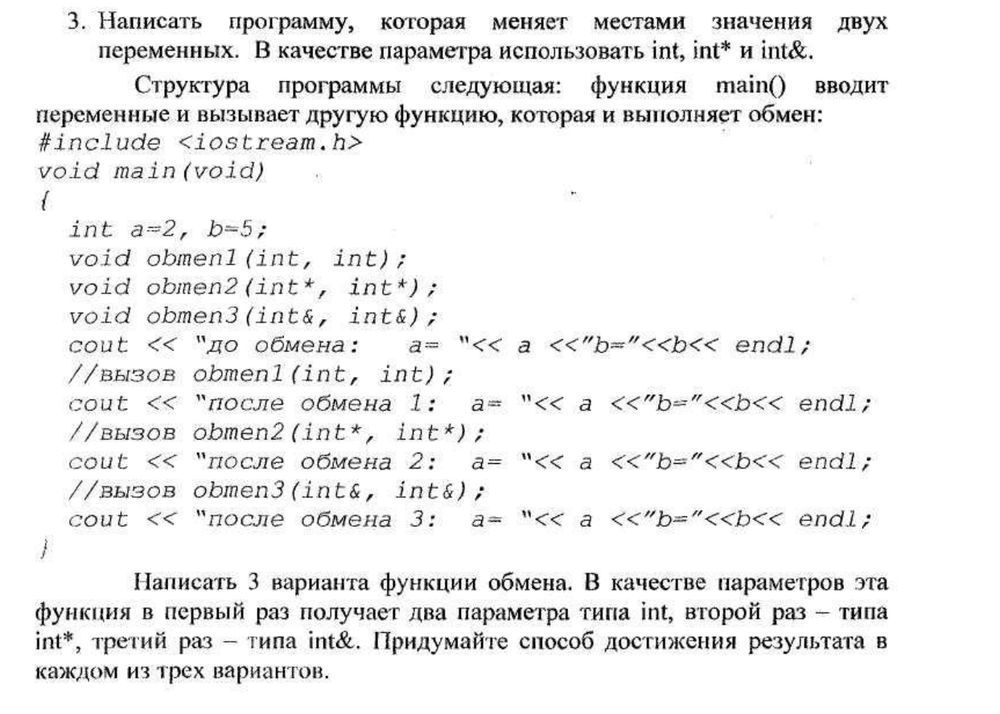
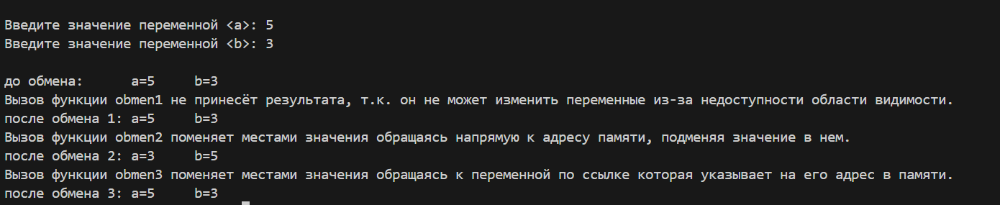

# Лабороторная работа №1
## 
### Задание 1:

#### Результат выполнения программы 1:

#### Ссылка на исходный код программы: [тут](./Exponention.cpp)

### Задание 2:

#### Результат работы программы 2:

#### Ссылка на исходный код программы: [тут](./PointerTask.cpp)

### Задание 3:

#### Результат работы программы 2:

#### Ссылка на исходный код программы: [тут](./PointerTask.cpp)
