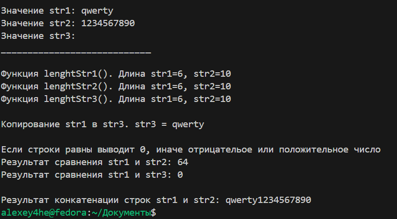

# Лабороторная работа №4

## Задача 1. 
### Познакомиться с библиотечными функциями работы со строками:
 - strlen() - определение длины строки
 - strcat() - конкатенация строк
 - strcpy() - копирование строк
 - strcmp() - сравнение строк
___
## Задача 2. 
#### Написать программу которая будет использовать свои варианты следующих функций:
 - определения длины строки (тремя разными способами) 
 - копирования строк
 - сравнения строк
 - конкатенации строк
____

### Функции для определения длины строки 

```c++
int lenghtStr1(const char* str) {
    int length = 0;
    while (*str++) length++;
    return length;
}

int lenghtStr2(const char* str) {
    int length = 0;
    for (; str[length] != '\0'; length++);
    return length;
}

int lenghtStr3(const char* str) {
    const char* s = str;
    while (*s) ++s;
    return s - str;
}
```

### Функция копирования строк
```c++
void copyStr(char* dest, const char* src) {
    while ((*dest++ = *src++));
}

```

### Функция сравнения строк
```c++
int comparyStr(const char* str1, const char* str2) {
    while (*str1 && (*str1 == *str2)) {
        str1++;
        str2++;
    }
    return *(unsigned char*)str1 - *(unsigned char*)str2;
}
```

### Функция конкатенации строк
```c++
void concatStr(char* dest, const char* src) {
    while (*dest) dest++;
    while ((*dest++ = *src++));
}
```
Код исходной программы доступен здесь: [тут](./programTask.cpp)


___
## Задача 3. 
#### Переписать функции так, что бы они использовали динамическую память при задании строк:

____
Код исходной программы доступен здесь: [тут](./ProgramTaskDynamicMemory.cpp)


___
## Задача 4. 
#### Изменить программу так, что бы вместо malloc() использовалась функция calloc(). В чем сходство и различие этих функций? :
Разница между **malloc()** и **calloc()** заключается в том: 

Что malloc() выделяет память но не инициализирует её. А calloc() выделяет и инициализирует её.
____
Код исходной программы доступен здесь: [тут](./programTaskDynamicMemoryCalloc.cpp)

