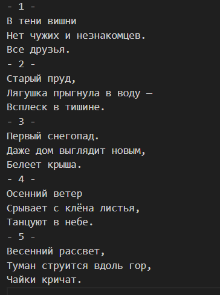
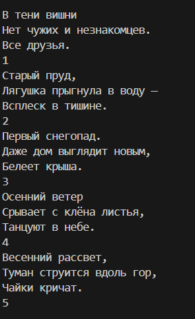

# Лабороторная работа №5

## Задача 1. 
### Разобрать прогруппу, выводящую содержимое текстового файла на экран. Как можно сократить текст программы? :

В моем случае данная программа не компилировалась, т.к. согласно современному стандарту С++ функция main Должна возвращать значение int. Исправил данную ситуацию.
В итоге код не сокращенной программы выглядит так:
```c++
#include <iostream>
#include <fstream>
#include <string>

int main() {
    std::string name;
    std::ifstream in;

    std::cout << "Введите имя файла для просмотра: ";
    std::cin >> name;

    in.open(name);
    if (!in) {
        std::cerr << "Файл " << name << " не открыт\n";
    } else {
        char ch;
        while (in.get(ch)) {
            std::cout.put(ch);
        }
        in.close();
    }

    return 0;
}

```
С целью сократить код программы уберем отдельное услование для проверки открытия файла и вывода сообщения об ошибки и получим:

```c++
#include <iostream>
#include <fstream>
#include <string>

int main() {
    std::string name;
    
    std::cout << "Введите имя файла для просмотра: ";
    std::cin >> name;

    std::ifstream in(name);
    if (!in.is_open()) {
        std::cerr << "Файл " << name << " не открыт. Т.к. вероятно не существует.\n";
        return 1;
    }

    char ch;
    while (in.get(ch)) {
        std::cout.put(ch);
    }

    return 0;
}

```

так же заменил блок кода с вызовм функции **feof(in)** на функцию **fgetc(in)** 
в итоге получил:

```c++
#include <iostream>
#include <fstream>
#include <string>

int main() {
    std::string name;
    
    std::cout << "Введите имя файла для просмотра: ";
    std::cin >> name;

    std::ifstream in(name);
    if (!in.is_open()) {
        std::cerr << "Файл " << name << " не открыт. Т.к. вероятно не существует.\n";
        return 1;
    }

    char ch;
    while (in.get(ch)) {
        std::cout.put(ch);
    }

    return 0;
}
```

____

## Задача 2
### Дополнить программу предыдущего пункта функцией подсчеты "пустыъ" и "не пустых" символов в текстовом файле. Под пустыми символами понимаются символы которые не отображаются на экарне: управляющие символы, пробел, звуковой сигнал и т.д.
______

Код исходной программы доступен здесь: [тут](./countCharProgram.cpp)

Вывод программы:


______


## Задача 3
### Дополнить программу первого пункта функцией поиска в текстовом файле заданной подстроки. Искомую подстроку необходимо передвать в качестве параметра функции. Результаты работы сформировать в отдельном файле. 
______
Код исходной программы доступен здесь: [тут](./findStringProgram.cpp)

Вывод программы:


______

## Задача 4
### Написать программу, которая обрабатывает текстовый файл следующим образом

В исходном тексте номера страниц проставлены в первой строке страницы. Требуется перенести эти номера в последнюю строку страницы и убрать знак переноса. *Например, номер страницы: - 34 -. Необходимо получить 34.*

Признаком перехода на следующую страницу является управляющий символ '\f'.

Код исходной программы доступен здесь: [тут](./pageSwapProgram.cpp)

### Оригинальный текс шаблона



### Обработанный текст :



## Задача 5
### Написать программу-шифратор файлов. Она читает из файла и пишет в другой файл закодированные символы.

Схема шифровки: с = с^key[i], где c - символ, считанный из файла;

key - ключ шифрования, строка, которая передается как параметр командной строки. Программа использует символы из key циклически, пока не будет считан весь ввод.

Для проверки правильности программа должна зашифровать зашифрованный файл еще раз с тем же ключом. Должен получиться файл - ТОЧНАЯ копия исходного файла. 

______
Код исходной программы доступен здесь: [тут](./encryptFileProgram.cpp)

Вывод программы:


______
