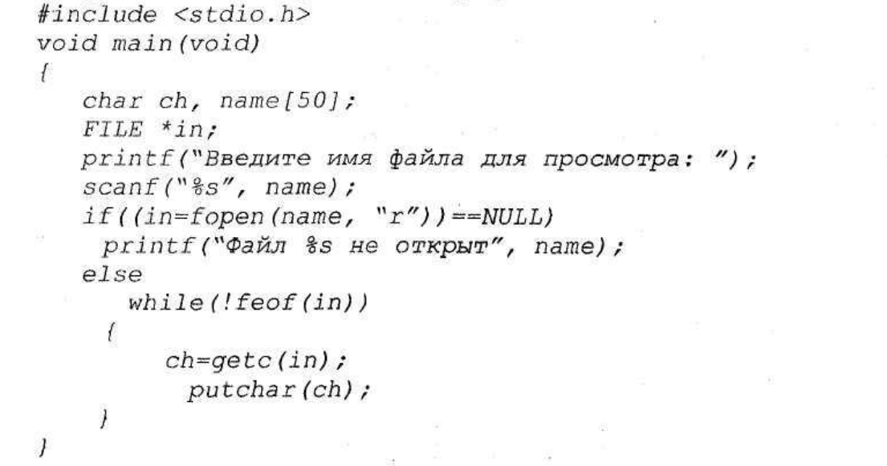
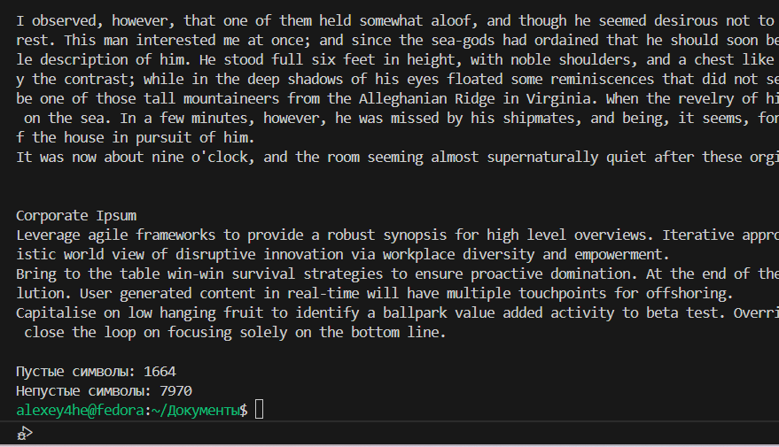
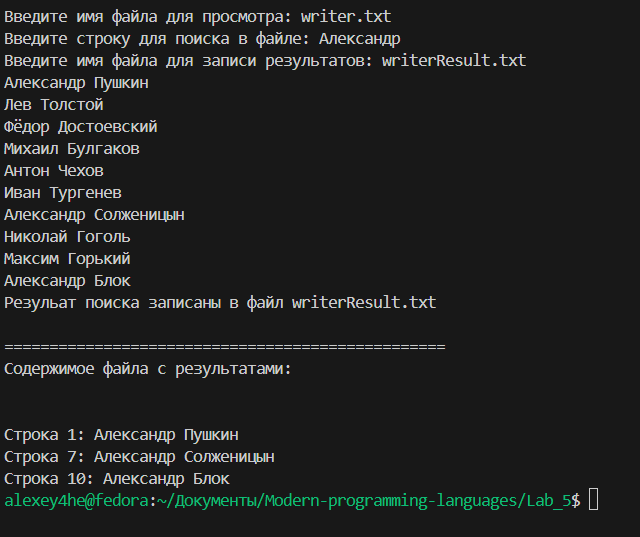

# Лабороторная работа №5

## Задача 1. 
### Разобрать прогруппу, выводящую содержимое текстового файла на экран. Как можно сократить текст программы? :

В моем случае данная программа не компилировалась, т.к. согласно современному стандарту С++ функция main Должна возвращать значение int. Исправил данную ситуацию.
В итоге код не сокращенной программы выглядит так:
```c++
#include <stdio.h>
int main(void){
    char ch, name[50];
    FILE *in;
    printf("Введите имя файла для просмотра: ");
    scanf("%s", name);
    if((in=fopen(name, "r"))==NULL)
        printf("Файл %s не открыт \n", name);
    else
        while (!feof(in))
        {
            ch=getc(in);
                putchar(ch);
        }
        return 0;
}
```
С целью сократить код программы уберем отдельное услование для проверки открытия файла и вывода сообщения об ошибки и получим:

```c++
#include <stdio.h>
int main(void){
    char ch, name[50];
    
    printf("Введите имя файла для просмотра: ");
    scanf("%s", name);

    FILE *in = fopen(name, "r");
    if (in == NULL){
        printf("Файл %s не открыт. Т.к. вероятно не существует. \n", name);
        return 1;
    }
   while ((ch = fgetc(in)) != EOF) {
    putchar(ch);
    }
    return 0;
}
```

так же заменил блок кода с вызовм функции **feof(in)** на функцию **fgetc(in)** 
в итоге получил:

```c++
#include <stdio.h>
int main(void){
    char ch, name[50];
    
    printf("Введите имя файла для просмотра: ");
    scanf("%s", name);

    FILE *in = fopen(name, "r");
    if (in == NULL){
        printf("Файл %s не открыт. Т.к. вероятно не существует. \n", name);
        return 1;
    }
   while ((ch = fgetc(in)) != EOF) {
    putchar(ch);
    }
}
```

____

## Задача 2
### Дополнить программу предыдущего пункта функцией подсчеты "пустыъ" и "не пустых" символов в текстовом файле. Под пустыми символами понимаются символы которые не отображаются на экарне: управляющие символы, пробел, звуковой сигнал и т.д.
______

Код исходной программы доступен здесь: [тут](./countCharProgram.cpp)

Вывод программы:


______


## Задача 3
### Дополнить программу первого пункта функцией поиска в текстовом файле заданной подстроки. Искомую подстроку необходимо передвать в качестве параметра функции. Результаты работы сформировать в отдельном файле. 
______
Код исходной программы доступен здесь: [тут](./findStringProgram.cpp)

Вывод программы:


______
